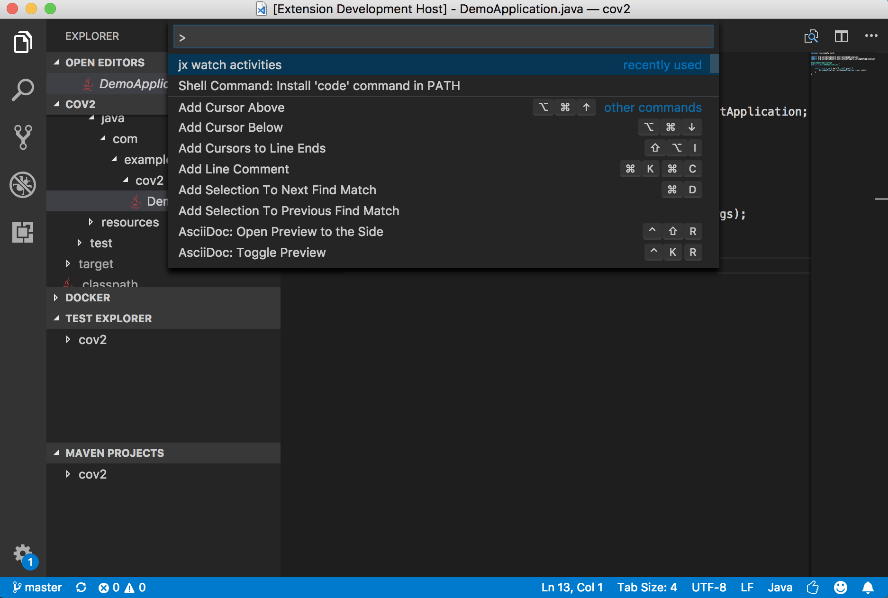
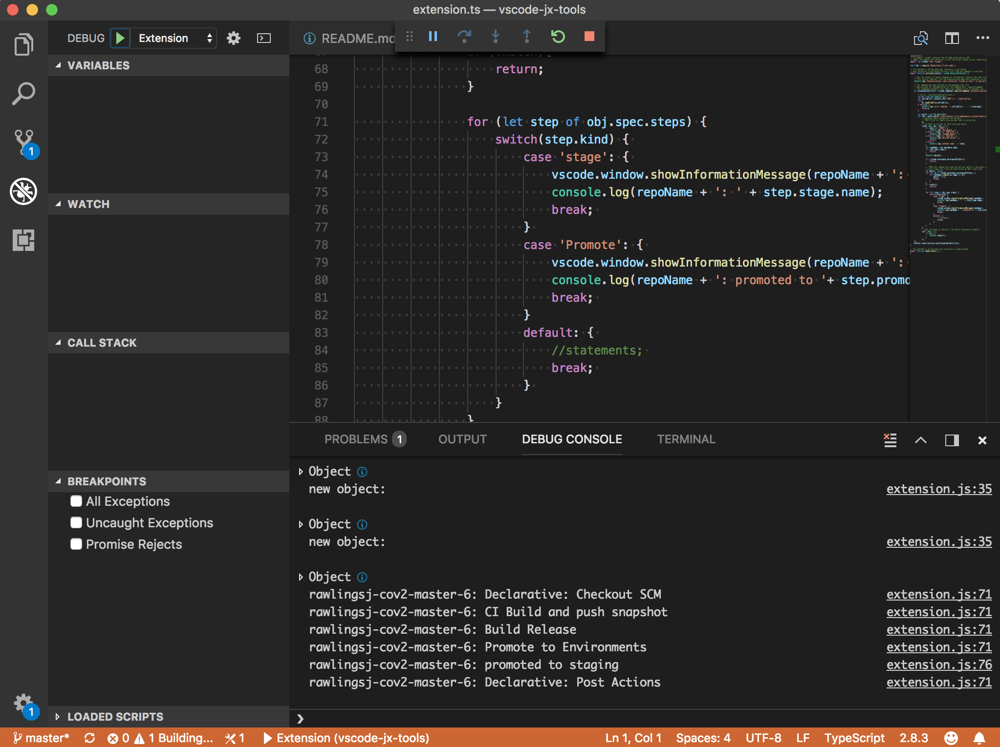

# vscode-jx-tools

A collection of VSCode tools to help working with Jenkins X

## Developing

To work on this extension first fork and clone the repo and run:

```
npm install
```

next open the project in VSCode

```
code .
```

Now you can choose the Debug tab from the left hand menu and press play or F5.  This will start a new VSCode which uses the extension.  

Now in the new VSCode open up a workspace that maps to a running jx app.

Activate the watch activities by opening up the VSCode palette `cmd` + `shift` + `p`, type `jx watch activities` and the extension command will be activated.  



In the first VScode with the extension workspace you should see logging in the debug console.


